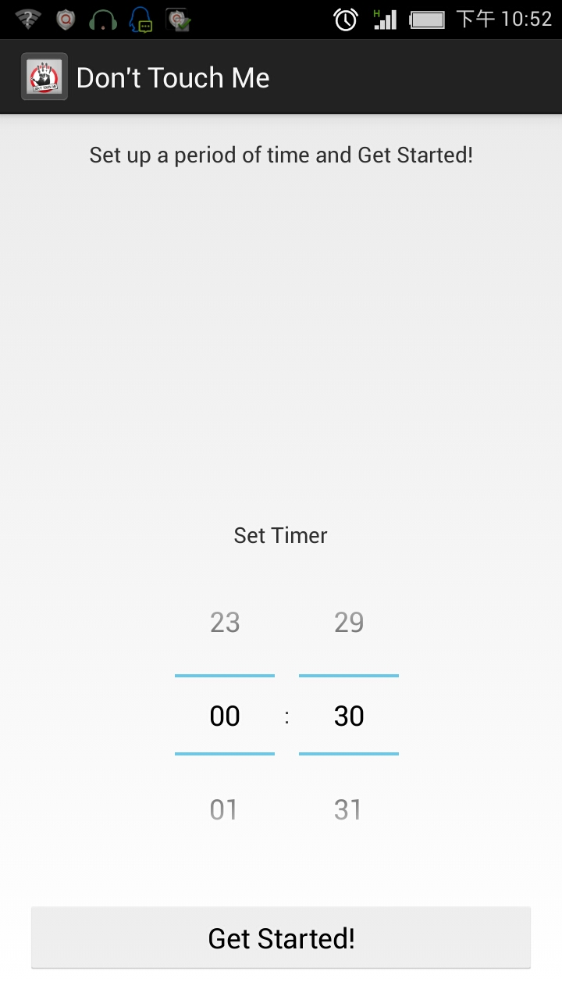
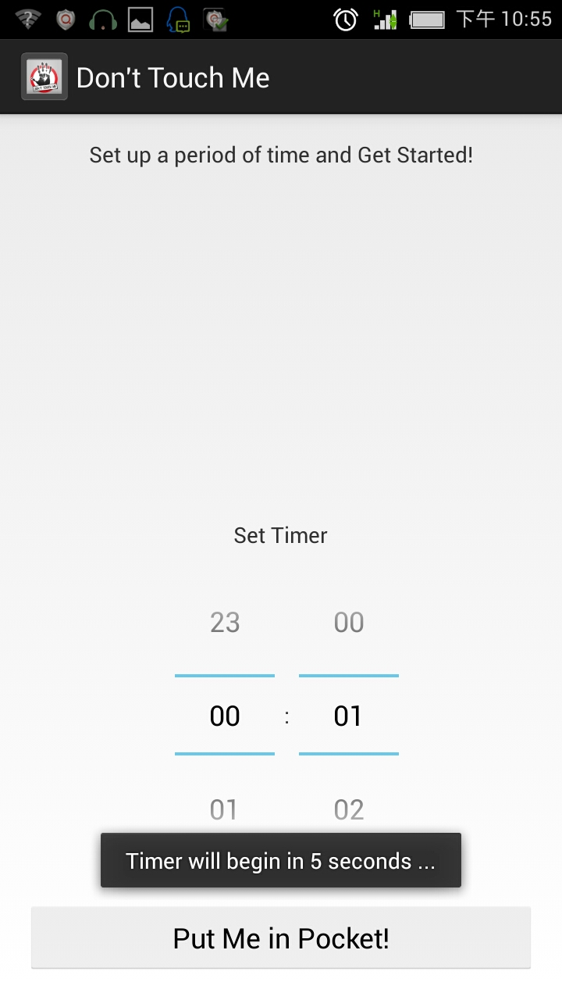
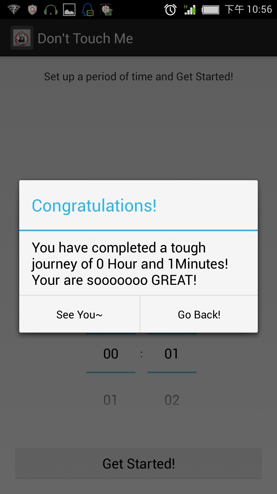
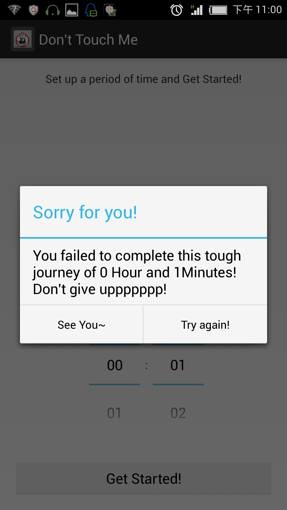

Dont-Touch-Me
=============

Or named "Stay-In-Pockey", an android app that helps users focus on work and study by keeping your smart phone away.

##Goal

**Make the phone unavailable**, we want to create obstacles between the phone and the people.

1. unable to touch it
2. unable to light up the phone
3. unable to play specific apps

the first one is the securest way to accomplish this goal.
You are even not able to get the battery out of phone to stop this app from working.

##Impl

Considering that users need to carry the phone when they are walking or moving, we figure out the phone to **stay in your pocket** is an appropriate way to achieve it.(Or you can also simply put it on your desk with its screen against your desk, because **technically we make use of the Proximity sensor to detect users' behavior**)

(Once you take your phone out of your pocket, or attempt to play your phone on the desk, sigh..)
Punishments:
1. Maximal-sound Annoying bell
2. Inpolite SMS sent to perple on your contacts randomly

NOTE: For users' demand, **this app allows user to use the phone on a phone call.** So just take it easy to answer your call and re-start it mannully afterwards :-P.

#Instructions

